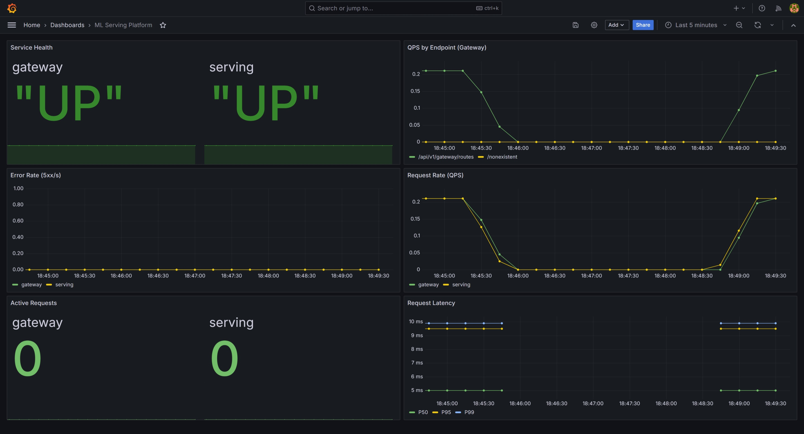

# ML 模型服务平台

[](README.md)


一个 AI 基础设施作品集项目，将训练好的 ML 和 LLM 模型转变为版本化、可观测、容器化的推理服务。覆盖从模型注册中心、Worker 路由到 A/B 发布、回滚、vLLM 代理、SSE 流式输出、Prometheus/Grafana 监控、压力测试，以及 Kubernetes 部署模板的完整生产服务链路。

**核心能力：** 模型注册与版本管理 · sklearn 推理 Worker · Gateway 路由 · 加权 A/B 流量分配 · 一键回滚 · vLLM Chat Completions · 端到端 SSE 流式 · Docker/GPU 容器 · Prometheus/Grafana · Helm/K8s 模板

### 快速导航

| 资源 | 路径 |
|------|------|
| 端到端演示 | [docs/demo.zh-CN.md](docs/demo.zh-CN.md) |
| 压测报告 | [docs/benchmark.zh-CN.md](docs/benchmark.zh-CN.md) |
| Helm Chart | [chart/](chart/) |
| CI 流水线 | [.github/workflows/ci.yml](.github/workflows/ci.yml) |
| Grafana 仪表盘 | [monitoring/grafana/](monitoring/grafana/) |

### 运行模式

| 模式 | 命令 | 启动内容 |
|------|------|----------|
| CPU | `docker compose up --build -d` | Registry、ML Worker、Gateway |
| 监控 | `docker compose -f docker-compose.yml -f docker-compose.monitor.yml up --build -d` | + Prometheus、Grafana |
| GPU / LLM | `docker compose -f docker-compose.yml -f docker-compose.gpu.yml up --build -d` | + LLM Worker、vLLM（需要 NVIDIA GPU） |

---

## 为什么做这个项目

本项目作为后端工程师转型 AI 基础设施方向的实战案例。聚焦于 AI Infra 团队实际负责的问题：安全发布模型版本、路由推理流量、在稳定 API 后隔离 GPU LLM 服务、度量延迟与错误、为容器编排做好准备。

简历要点：

| 领域 | 证明 |
|------|------|
| 端到端服务 | Registry -> ML Worker -> Gateway 预测链路，支持版本化 sklearn 模型 |
| 安全发布 | 动态 A/B 路由配置、加权选择、回滚历史 |
| 真实 LLM 服务 | vLLM OpenAI 兼容后端 + 轻量 LLM Worker 代理 |
| 流式输出 | SSE 块从 vLLM -> LLM Worker -> Gateway -> 客户端全链路无缓冲 |
| 可观测性 | Prometheus HTTP/推理指标、Grafana 仪表盘、告警规则 |
| 性能 | Locust 压测在 200 并发用户下达到约 454 RPS，0% 错误率 |
| 部署 | CPU/GPU Docker Compose 栈，Helm Chart 含 HPA、Ingress、PVC、GPU 调度模板 |
| 质量门禁 | pytest、Docker 构建验证、Helm lint/template、kubeconform（GitHub Actions） |

---

## 架构

```text
┌──────────┐
│  Client  │
│ curl/API │
└────┬─────┘
     │
     ▼
┌──────────────────────────────────────────┐
│              Gateway :8002               │
│  ┌───────────────┐  ┌─────────────────┐  │
│  │ ML 路由       │  │ LLM 路由        │  │
│  │ A/B 测试      │  │ SSE 流式        │  │
│  │ 回滚          │  │ Chat 转发       │  │
│  └───────┬───────┘  └───────┬─────────┘  │
└──────────┼───────────────────┼───────────┘
           │                   │
      ┌────▼────┐       ┌──────▼──────┐     ┌───────────┐
      │ML Worker│       │ LLM Worker  │────▶│   vLLM    │
      │  :8001  │       │   :8003     │     │   :8100   │
      │ sklearn │       │ HTTP Proxy  │     │ Qwen 1.5B │
      └─────────┘       └─────────────┘     │   GPU     │
                                            └───────────┘
      ┌─────────┐
      │Registry │
      │  :8000  │
      │ SQLite  │
      │ + Files │
      └─────────┘

      Prometheus :9090  +  Grafana :3000
```

| 组件 | 说明 | 状态 |
|------|------|------|
| **Registry** | 模型元数据、语义版本、默认版本、文件上传/下载 | 完成 |
| **ML Worker** | sklearn 模型加载、进程内预测、模型卸载/列表 API | 完成 |
| **Gateway** | Worker 注册、路由查找、预测转发、健康检查 | 完成 |
| **A/B Router** | 加权后端选择、动态发布配置、回滚历史 | 完成 |
| **LLM Worker** | 到 vLLM 的轻量 HTTP 代理，自定义超时/连接/错误映射 | 完成 |
| **vLLM Engine** | GPU 容器运行 Qwen2.5-1.5B-Instruct，OpenAI 兼容 API | 完成 |
| **Monitoring** | Prometheus 中间件、推理指标、Grafana 仪表盘、告警 | 完成 |
| **CI/CD** | pytest、Docker 构建、Helm lint/template、kubeconform 验证 | 完成 |
| **K8s/Helm** | Deployments、Services、PVCs、HPA、Ingress、GPU 资源模板 | 生产级模板 |

---

## 快速开始

### CPU 栈

```bash
# 启动 Registry、ML Worker 和 Gateway
docker compose up --build -d

# 运行端到端 CPU 演示
bash scripts/demo.sh

# 运行测试
pytest tests/ -v
```

服务地址：

| 服务 | URL |
|------|-----|
| Registry | http://localhost:8000 |
| ML Worker | http://localhost:8001 |
| Gateway | http://localhost:8002 |
| Swagger UI | http://localhost:8000/docs, http://localhost:8001/docs, http://localhost:8002/docs |

### 监控栈

```bash
docker compose -f docker-compose.yml -f docker-compose.monitor.yml up --build -d
bash scripts/demo.sh
```

打开以下地址：

| 工具 | URL | 默认登录 |
|------|-----|----------|
| Prometheus | http://localhost:9090 | 无 |
| Grafana | http://localhost:3000 | admin / admin |

### GPU / LLM 栈

需要 NVIDIA Container Toolkit 和足够显存的 GPU。

```bash
docker compose -f docker-compose.yml -f docker-compose.gpu.yml up --build -d
RUN_GPU_DEMO=1 bash scripts/demo.sh
```

GPU 栈新增服务：

| 服务 | URL |
|------|-----|
| LLM Worker | http://localhost:8003 |
| vLLM | http://localhost:8100 |

完整演示说明见 [docs/demo.md](docs/demo.md)。

---

## 演示流程

可运行的演示脚本覆盖面向简历的 CPU 路径：

1. 验证 Registry、ML Worker 和 Gateway 健康状态。
2. 训练或复用本地 Iris sklearn 模型文件。
3. 在 Registry 注册 `iris-classifier` 并创建版本 `1.0.0` 和 `2.0.0`。
4. 上传模型文件到 Registry 元数据/文件存储。
5. 将两个版本加载到 ML Worker。
6. 在 Gateway 注册两条 Worker 路由。
7. 通过 Gateway 发送预测流量。
8. 配置 90/10 A/B 路由并展示路由结果。
9. 回滚到版本 `1.0.0` 并打印回滚历史。
10. 可选：注册 LLM Worker 并调用非流式 + 流式聊天。

```bash
bash scripts/demo.sh
```

演示设计为 CPU 优先，方便面试官无需 GPU 即可快速运行。LLM 路径通过 `RUN_GPU_DEMO=1` 单独启用。

---

## 监控

平台通过 Prometheus 中间件暴露服务和推理指标：

| 指标 | 类型 | 用途 |
|------|------|------|
| `http_requests_total` | Counter | 按服务/方法/端点/状态统计请求量 |
| `http_request_duration_seconds` | Histogram | 按服务和端点统计 HTTP 延迟分布 |
| `http_active_requests` | Gauge | 按服务统计当前在途请求数 |
| `inference_requests_total` | Counter | Gateway 推理转发结果（按模型/版本/状态） |
| `inference_duration_seconds` | Histogram | 端到端 Gateway -> Worker 推理延迟 |

告警规则覆盖：5xx 高错误率、抓取目标宕机、P95 延迟突增、吞吐量下降、活跃请求饱和。



---

## 性能

Locust 压测结果详见 [docs/benchmark.md](docs/benchmark.md)。

| 并发用户 | 总 RPS | P50 | P95 | P99 | 错误率 |
|----------|--------|-----|-----|-----|--------|
| 10 | 23.88 | 5ms | 9ms | 16ms | 0% |
| 50 | 120.79 | 5ms | 11ms | 18ms | 0% |
| 100 | 239.00 | 4ms | 12ms | 22ms | 0% |
| 200 | 453.77 | 4ms | 17ms | 30ms | 0% |

观测到的瓶颈：SQLite 写竞争加上单 Uvicorn Worker 在写密集场景（模型注册延迟）最先受影响。这正是将 PostgreSQL 和连接池列为下一步生产硬化方向的原因。

---

## Kubernetes 与 Helm

Chart 部署 Registry、ML Worker、Gateway、可选 LLM Worker 和可选 vLLM。包含资源 requests/limits、PVCs、HPA 模板、Ingress 和 vLLM GPU 资源限制。

> **`chart/` 与 `k8s/` 的区别：** `chart/` 是 Helm Chart（模板化、参数化）；`k8s/` 是纯 Kubernetes 清单，无需 Helm 即可通过 `kubectl apply` 快速部署。

```bash
# 本地/minikube 渲染
helm lint chart/ -f chart/values-dev.yaml
helm template ml-dev chart/ -f chart/values-dev.yaml

# 生产级渲染
helm lint chart/ -f chart/values-prod.yaml
helm template ml-prod chart/ -f chart/values-prod.yaml
```

重要生产注意事项：

- `registry.persistence` 在默认 Chart 中使用 PVC 存储 SQLite 数据和模型文件。
- 生产 values 中 Registry HPA 已禁用，因为 SQLite on ReadWriteOnce PVC 不支持高可用。
- 仅在引入 PostgreSQL 元数据 + S3/MinIO 文件存储后再启用 Registry 水平扩展。
- vLLM GPU 调度需要集群上安装 NVIDIA Device Plugin。
- Ingress TLS 需要预创建证书 Secret 或集成 cert-manager。

---

## API 参考

Registry 端点需要 `X-API-Key`。开发默认接受 `dev-api-key` 用于本地演示。

<details>
<summary><b>Registry - 模型与版本</b></summary>

| 方法 | 端点 | 说明 |
|------|------|------|
| POST | `/api/v1/models` | 注册模型 |
| GET | `/api/v1/models` | 列出模型 |
| GET | `/api/v1/models/{name}` | 获取模型详情 |
| PATCH | `/api/v1/models/{name}` | 更新模型元数据 |
| DELETE | `/api/v1/models/{name}` | 删除模型及其版本 |
| POST | `/api/v1/models/{name}/versions` | 创建版本 |
| GET | `/api/v1/models/{name}/versions` | 列出版本 |
| GET | `/api/v1/models/{name}/versions/{ver}` | 获取版本详情 |
| POST | `/api/v1/models/{name}/versions/{ver}/upload` | 上传模型文件 |
| GET | `/api/v1/models/{name}/versions/{ver}/download` | 下载模型文件 |
| PUT | `/api/v1/models/{name}/versions/{ver}/default` | 设置默认版本 |

</details>

<details>
<summary><b>Gateway - 路由、A/B 测试与 LLM</b></summary>

| 方法 | 端点 | 说明 |
|------|------|------|
| POST | `/api/v1/gateway/register` | 注册 Worker 路由 |
| DELETE | `/api/v1/gateway/routes/{model}/{version}` | 移除 Worker 路由 |
| GET | `/api/v1/gateway/routes` | 列出路由 |
| POST | `/api/v1/gateway/predict/{model}/{version}` | 转发 ML 预测 |
| POST | `/api/v1/gateway/chat/{model}/{version}` | 转发 LLM 聊天 |
| POST | `/api/v1/gateway/chat/{model}/{version}/stream` | 转发 LLM 聊天（SSE 流式） |
| POST | `/api/v1/gateway/ab/configure` | 配置加权 A/B 路由 |
| POST | `/api/v1/gateway/ab/predict/{model}` | 通过 A/B 路由预测 |
| POST | `/api/v1/gateway/ab/rollback/{model}` | 将 100% 流量切换到指定版本 |
| GET | `/api/v1/gateway/ab` | 列出 A/B 配置 |
| GET | `/api/v1/gateway/ab/{model}` | 获取 A/B 配置 |
| DELETE | `/api/v1/gateway/ab/{model}` | 移除 A/B 配置 |
| GET | `/api/v1/gateway/ab/rollback-history/{model}` | 查看回滚历史 |
| GET | `/api/v1/gateway/health/{model}/{version}` | 检查已注册 Worker 健康状态 |

</details>

<details>
<summary><b>LLM Worker</b></summary>

| 方法 | 端点 | 说明 |
|------|------|------|
| GET | `/health` | 健康检查（含 vLLM 后端状态） |
| POST | `/api/v1/chat/completions` | Chat Completion，支持流式和非流式 |

</details>

---

## 关键设计决策

| 决策 | 选择 | 原因 |
|------|------|------|
| 服务拆分 | Registry、ML Worker、Gateway、LLM Worker、vLLM | 不同的状态模型、扩展需求和硬件特征 |
| LLM 集成 | 基于 vLLM OpenAI API 的轻量 HTTP 代理 | Gateway 不依赖引擎细节，后端可替换 |
| 发布模型 | 加权 A/B 路由 + 回滚历史 | 支持渐进发布和快速回退 |
| 流式 | 端到端 SSE | 客户端支持简单，增量 Token 投递 |
| 错误映射 | 503 连接失败、504 超时、502 后端响应异常 | 让基础设施故障模式对调用方可见 |
| 可观测性 | Prometheus 中间件 + Grafana 仪表盘 | 捕获流量、延迟、错误、饱和度 |
| 本地数据库 | SQLite | 零依赖开发路径；明确 PostgreSQL 为下一步 |
| 文件存储 | 本地 FS 抽象 + S3 扩展点 | 保持本地演示简单，同时保留生产方向 |

---

## CI/CD

GitHub Actions 在每次 push 和 pull request 时通过 [.github/workflows/ci.yml](.github/workflows/ci.yml) 运行：

- Python 3.11 上运行 `pytest tests/ -v`，含 pip 缓存。
- Helm lint 和 template 验证（dev/prod values）。
- kubeconform 验证渲染后和原始 Kubernetes 清单。
- Docker 构建验证 Registry 镜像。
- 同一分支旧工作流运行自动取消。

---

## 路线图

- [x] **阶段 1** - 模型注册中心：元数据 CRUD、版本管理、默认版本、文件存储
- [x] **阶段 2** - 模型服务：sklearn 加载、预测、Gateway 路由
- [x] **阶段 3** - 流量管理：加权 A/B 分流、回滚、历史记录
- [x] **阶段 4** - LLM 集成：vLLM 后端、LLM 代理、流式输出、GPU 容器
- [x] **阶段 5** - 可观测性：Prometheus 指标、Grafana 仪表盘、告警规则、压测报告
- [x] **阶段 6** - 部署模板：Docker Compose、Helm Chart、HPA、Ingress、GPU 调度模板
- [ ] **下一步** - PostgreSQL 元数据存储、Redis 缓存、OpenTelemetry 链路追踪、S3/MinIO 文件后端、限流、vLLM 熔断器

---

## 生产边界

本仓库有意针对本地可复现性和面试讨论进行优化。当前默认配置足以展示系统设计和服务工作流，但以下变更是真实生产部署前的建议：

| 边界 | 当前状态 | 生产方向 |
|------|----------|----------|
| Registry 元数据 | SQLite | PostgreSQL + 迁移 + 连接池 |
| 模型文件 | 本地文件系统 | S3/MinIO 兼容对象存储 |
| Registry 扩展 | 单写入者，prod values 中 HPA 已禁用 | 引入 HA 元数据/文件存储后启用 |
| 认证 | 开发 API Key | 外部密钥管理、作用域 Key 或 JWT/RBAC |
| 链路追踪 | 仅指标和日志 | OpenTelemetry Span 贯穿 Gateway、Worker、vLLM |
| 容错 | 明确的 vLLM 错误映射 | 重试预算、熔断器、背压/限流 |

---

## 我的收获

1. **LLM 服务与传统 ML 服务是不同的延迟类别。** sklearn 预测是毫秒级 CPU 运算；LLM 生成是 GPU 绑定的自回归解码。这一差异驱动了流式、超时和可观测性设计。
2. **轻量代理让基础设施保持灵活。** Gateway 不需要了解 vLLM 的 tokenization 或调度细节，因此后端可以迁移到 TensorRT-LLM、Triton 或其他引擎。
3. **安全发布是基础设施能力。** A/B 路由和回滚不是产品润色；它们是模型团队发版而不至于每次都全量切流的保障。
4. **可观测性把 Demo 变成工程系统。** QPS、延迟分位数、5xx 率和活跃请求数让性能和故障模式有了可讨论的具体证据。
5. **Kubernetes 支持不仅仅是 YAML。** HPA、PVCs、GPU 调度、Ingress 和存储注意事项都需要与实际状态模型对齐。

---

## 技术栈

| 层级 | 技术 |
|------|------|
| API 框架 | FastAPI |
| 数据验证 | Pydantic v2 |
| 元数据存储 | SQLite（本地默认），PostgreSQL（规划中） |
| 模型存储 | 本地 FS（默认），S3/MinIO（规划中） |
| 传统 ML | scikit-learn, joblib |
| LLM 推理 | vLLM |
| 流式 | Server-Sent Events |
| 可观测性 | prometheus-client, Prometheus, Grafana |
| 压力测试 | Locust |
| 容器化 | Docker, Docker Compose, NVIDIA runtime |
| 编排 | Kubernetes manifests, Helm |
| 测试 | pytest, httpx ASGITransport |

## 许可证

MIT
